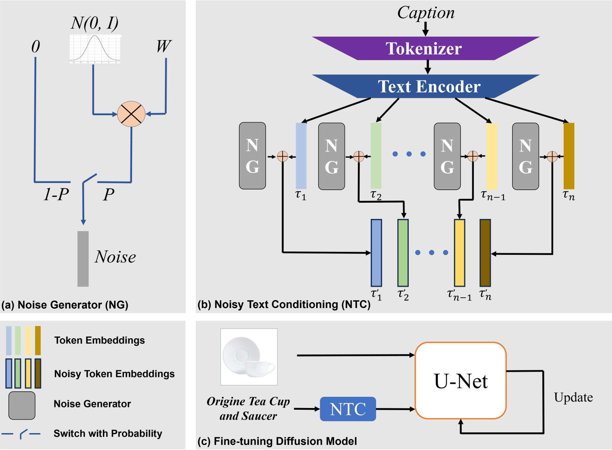

# FPAN:Mitigating Replication in Diffusion Models through the Fine-Grained Probabilistic Addition of Noise to Token Embeddings
This repo contains code for the paper: FPAN: Mitigating Replication in Diffusion Models through the Fine-Grained Probabilistic Addition of Noise to Token Embeddings.-[paper link](https://arxiv.org/abs/2505.21848)
## Overview

## Requirement
```txt
diffusers == 0.32.1
huggingface-hub == 0.27.1
img2dataset == 1.41.0
openai == 0.27.8
timm == 0.9.2
spacy == 3.7.6
torch == 2.5.1
torchvision == 0.20.1
transformers == 4.47.1
webdataset == 0.2.100
pytorch-fid == 0.3.0

